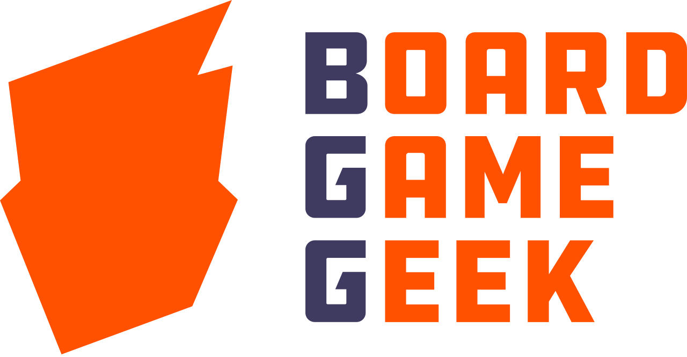
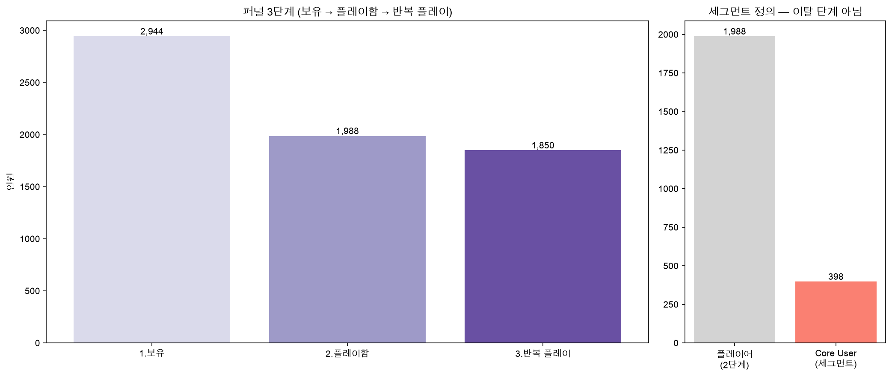
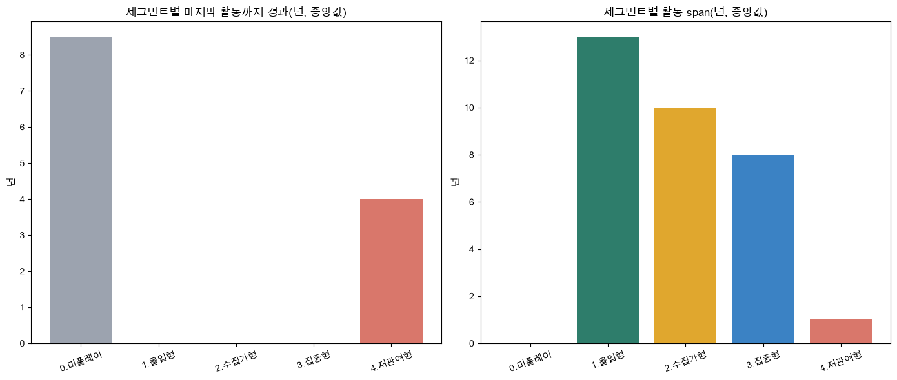
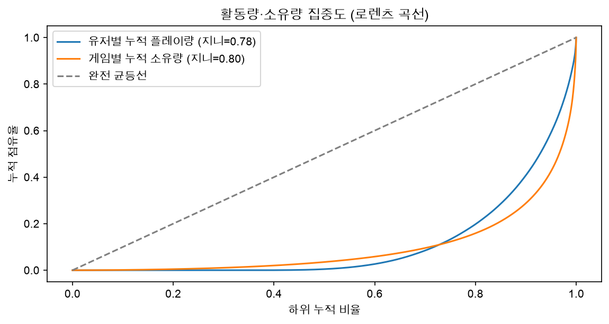
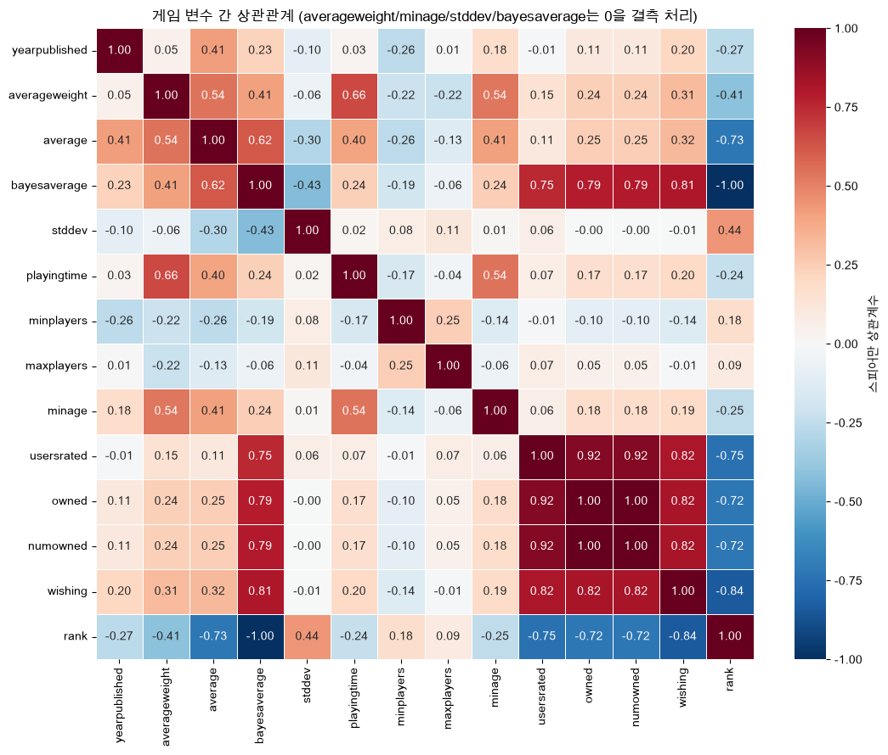
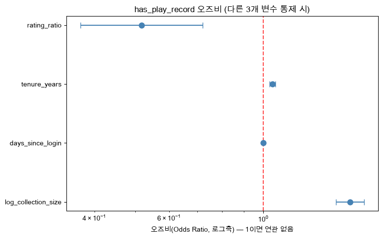
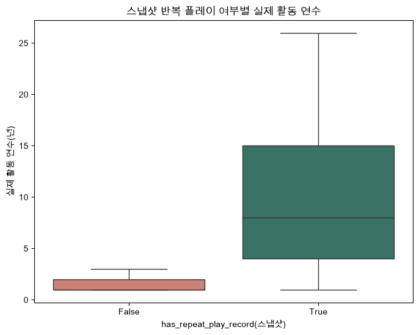
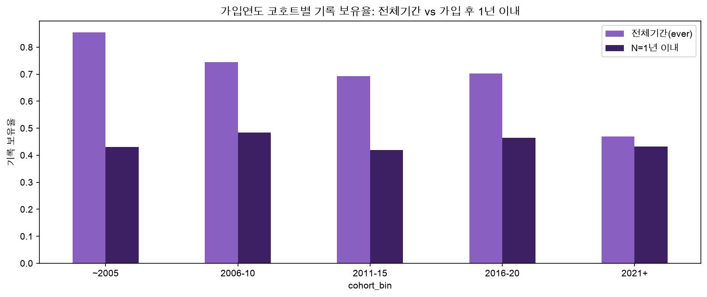
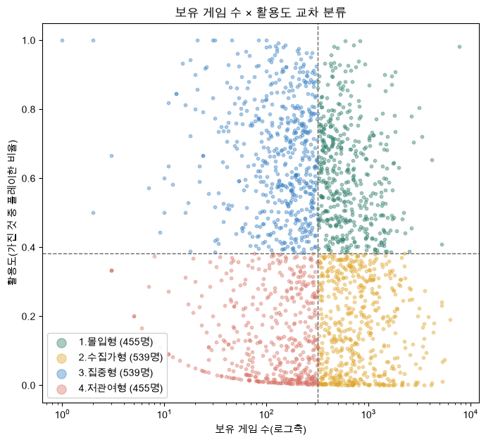
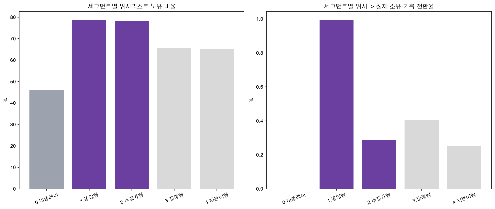

<div align="center">



<h1>🎲 BGG 유저 미플레이 분석</h1>

<p>
  <strong>BoardGameGeek(BGG) 유저 행동 데이터로, 구매한 보드게임이 실제 플레이로 이어지지 못하는 지점을 규명한 분석 프로젝트</strong><br>
</p>

<p>
  
  
  
  
  
  
  
</p>

</div>

## Overview

> - [BoardGameGeek(BGG)](https://boardgamegeek.com/)은 세계 최대 보드게임 사이트다.
> - 보드게임 시장은 매출 규모로는 [성장 중](https://www.verifiedmarketresearch.com/product/board-games-market/)이지만 신규 유저 유입은 정체.
> - 업계는 원인을 ["게임이 어려워서 초보자가 못 버틴다"](https://therewillbe.games/articles-essays/6578-barrier-to-entry-why-don-t-board-games-sell-like-video-games)와 ["사놓고 안 하는 백로그 현상"](https://tabletopstrategy.wordpress.com/2021/02/19/the-shelf-of-shame/) 두 가지로 진단
> - 실제 유저 행동 데이터로 검증된 적은 없기에 BGG 유저 3,000명의 소유·평가·플레이 데이터를 직접 수집해
> - 어디서 얼마나 다음 단계로 넘어가지 못하는지, 그 정체가 어떤 유저 특성과 함께 움직이는지, 시간이 지나도 그 구분이 유지되는지를 검증.

| 항목 | 내용 |
|:-----|:-----|
| **📅 Date** | 2026.08.13 ~ 2026.09.09 |
| **👥 Type** | 개인 프로젝트|
| **🎯 Goal** | 어디서 유저를 놓치는지 숫자로 짚고, 그 지점에 뭘 하면 좋을지 근거를 남긴다 |
| **🔧 Tech Stack** | Python, BigQuery(SQL), pandas, scipy, statsmodels, scikit-learn|
| **📊 Dataset** | [BGG API](https://boardgamegeek.com/wiki/page/BGG_XML_API2) 사용(user / collection / thing / plays), 유저 3,000명 · 게임 85,442개 |

전체 분석은 `jupyter/`의 [01.EDA](jupyter/01.EDA.ipynb) → [02.Funnel](jupyter/02.Funnel_Retention.ipynb) → [03.Segment](jupyter/03.Segment_Wishlist.ipynb) → [04.Trend](jupyter/04.Trend.ipynb) 순으로 읽는다.

---

## Insight

- 퍼널 최대 손실 구간을 **보유 → 첫 플레이(-32.5%p, 956명)** 으로 특정
- 보유 게임 수만으로 유저를 나누면 안 된다는 것을 규명하고, **보유 게임 수와 활용도 두 축을 교차**해 5개 유형으로 재정의
- 가설 3개 검정:
    - H1 채택(효과 크기 **0.81**)
    - H2 부분 채택
    - H3 기각(기간 미통제 시 85.5%→47.0%로 보였으나, 가입 후 동일 기간 기준 공정 비교 시 코호트 간 차이 거의 없음)
    - **"위험군은 수집가형이 아니라 저관여형"** 이라는 통념 반전 발견(H2)

<div align="center">


</div>

---

## Analysis

> 자세한 근거는 각 노트북 링크 참고.

- **[01.EDA](jupyter/01.EDA.ipynb)**: 
   - 유저 활동, 게임 특성의 분포부터 확인. 
   - 지니계수 0.78~0.80으로 활동이 소수에 쏠려 있어, 평균만으로는 유저를 설명할 수 없다는 걸 먼저 확인해야 했음. 
   - 게임 변수 14개 상관구조도 같이 확인해, 인기 지표들은 서로 강하게 묶이고 복잡도는 평점과 약하게만 연결된다는 걸 파악
- **[02.Funnel](jupyter/02.Funnel_Retention.ipynb)**: 
   - 활동이 쏠려 있다면 그 경계가 어디인지 실측 필요 
   - 보유→플레이→반복 플레이 3단계로 나눠 어디서 가장 많이 빠지는지 확인. 
   - 로지스틱 회귀로 보유 게임 수·평가 참여율 등 후보 변수의 영향을 오즈비로 비교
- **[03.Segment](jupyter/03.Segment_Wishlist.ipynb)**: 
   - 퍼널에서 보유 게임 수 하나만으론 전환을 설명 못 한다는 게 드러나, 
   - 보유 게임 수 × 활용도 두 축으로 유형을 다시 나눠 손실 구간에 누가 있는지 확인

<div align="center">



</div>

**가설 수립**

> EDA와 퍼널·세그먼트 분석이 한 시점 데이터만으로는 답하지 못하고 남긴 질문 세 가지를 가설로 세웠다.

| 가설 | 왜 세웠나 |
|---|---|
| **H1.** 반복 플레이한 유저는 안 한 유저보다 활동 기간이 더 길 것이다 | - EDA에서 "같은 게임을 두 번 이상 했다"는 것까지만 확인<br>- 그게 언제였는지 몰라 오래가는 참여인지 검증 필요 |
| **H2.** 보유 게임 수 × 활용도 유형 간 활동 지속성 차이는 시간이 지나도 유지될 것이다 | - 4 유형의 경계가 군집화로 어느 정도 뒷받침됐지만<br>- 전부 한 시점 데이터라, 시간이 지나도 유지되는지 불명 |
| **H3.** 최근에 가입한 유저일수록 게임을 플레이하는 비율이 더 낮을 것이다 | - 가입자 수 정체·감소 구간은 확인했지만<br> - "가입 자체가 준 것"인지 "가입은 했는데 플레이로 안 이어진 것"인지 구분 안 됨 |

> 검증은 플레이 로그를 수집한 1,065명 중 실제 기록이 있는 729명을 대상으로 [04.Trend](jupyter/04.Trend.ipynb)에서 진행

<br>

**가설 검증**

| 가설 | 검정 결과 | 판정 |
|---|---|:---:|
| H1 | - 반복 플레이 있음 647명은 활동 연수 중앙값 8년·2026년까지 활동<br>- 없음 82명은 1년·마지막 활동 7년 전<br>- 효과 크기 0.81, 매우 큼 | 채택 |
| H2 | - 몰입형·수집가형·집중형은 지금도 활동 중<br>- 저관여형만 마지막 활동 4~5년 전<br>- "위험군은 수집가형"이라는 사전 예상과 반대로 확인 | 부분 채택 |
| H3 | - 기간 미통제 시 85.5%→47.0%로 하락처럼 보이나<br>- 가입 후 1년 이내 기준으로 공정 비교하면 코호트 간 43~48%로 차이 거의 없음(카이제곱 p=0.635)<br>- 1차 결과는 관측 기간 편향으로 판단 | 기각 |

<div align="center">


</div>

---

## Results

> **퍼널 3단계**: 게임을 보유한 2,944명이 실제로 플레이하고, 반복 플레이까지 이어지는지 실측

<table>
<tr>
<td valign="top">

| 단계 | 인원 | 직전 대비 |
|---|---:|---:|
| 1. 보유 게임 있음 | 2,944명 | 전체의 98.1% |
| 2. 플레이함 | 1,988명 | **-32.5%p (최대 손실)** |
| 3. 반복 플레이함 | 1,850명 | -6.9%p |

</td>
<td width="45%">

</td>
</tr>
</table>

**보유 게임 수 × 활용도 세그먼트**

| 세그먼트 | 인원 | 어떤 사람인가 |
|---|---:|---|
| 미플레이 | 956명 | 게임은 갖고 있지만 플레이한 적이 하나도 없음 ([04.Trend 2-2](jupyter/04.Trend.ipynb)) |
| 몰입형 | 455명 | 많이 갖고 있고, 가진 것도 잘 씀 |
| 수집가형 | 539명 | 많이 갖고 있지만, 그중 일부만 씀 |
| 집중형 | 539명 | 적게 갖고 있지만, 가진 것을 알뜰히 씀 |
| 저관여형 | 455명 | 적게 갖고 있고 그마저도 잘 안 씀, 마지막 로그인이 가장 오래됨 |

> 이 경계는 실루엣 계수 0.32~0.35로 낮아 "데이터가 찾은 자연 군집"은 아니고, 분석 목적에 맞춰 정의한 틀임을 명시.  
> 위시리스트에 담은 게임의 99%는 실제 플레이로 안 이어져, 위시리스트는 구매 예고가 아니라 관심 표시에 가까움.

<div align="center">


</div>

---

## Action

> 아래 액션은 위 Insight/Results에서 도출한 제안.  
> 다만 데이터가 인과를 증명한 것이 아니라 관찰된 패턴에서 나온 가설이므로, 각 행에 실행 후 확인할 검증 방법을 함께 기재.

| 타깃 | 근거 | 제안 액션 | 검증 방법(제안) |
|---|---|---|---|
| 게임을 산 직후의 모든 유저 | 퍼널 최대 손실 구간(-32.5%p) | 등록 즉시 배지 지급<br>7일 미기록 시 플레이 안내 | 배지 노출군 vs 비노출군<br>첫 플레이 전환율 A/B 테스트 |
| 최근 가입자(2021년 이후) | 가입 후 1년 이내 정착률<br>전 코호트 43~48%로 고르게 낮음 | 가입 후 3일 내 행동 기반<br>온보딩 메일 자동 발송 | 가입 후 3일 내<br>첫 플레이 기록률(코호트별) |
| 저관여형(몇 년째 안 돌아옴) | H2 | 3~5회 순차 발송<br>컴백 캠페인 | 발송 후 30~45일 내<br>재활동 비율 |
| 수집가형(쟁여둔 건 많지만 지금도 활동 중) | H2 | 미플레이 보유 게임<br>"다음에 할 게임" 추천 | 추천 클릭률<br>추천 후 플레이 전환율 |
| 평가만 하고 플레이는 안 하는 유저 | [Segment 분석](jupyter/03.Segment_Wishlist.ipynb) | 평점 등록 직후<br>플레이 기록 유도 안내 | 안내 노출 후<br>7일 내 플레이 전환율 |
| 집중형(원하는 게임과 실제 하는 게임의 난이도 차가 가장 큼) | [Segment 분석](jupyter/03.Segment_Wishlist.ipynb) | 위시리스트 게임과<br>난이도 유사 신작 추천 | 추천 후<br>구매·플레이 전환율 |

> - 다만 이 프로젝트가 다룬 건 이미 가입해서 게임을 보유한 사람들의 행동뿐.
> - 신규 유입 자체를 늘리는 액션은 이 데이터로 증명 불가
> - 위 제안은 기존 유저를 붙잡는 데서 확인된 패턴을 신규 유저 온보딩 설계에 참고할 가설로 남김.

---

## Lesson and Learned

**Takeaways**
- 편향된 데이터는 사후 보정보다 처음부터 다시 수집하는 편이 더 확실하다는 것을, 시간 절단 편향을 발견하고 표집틀을 신뢰구간 기반으로 재구축하면서 확인
- 회귀 모델에서는 종속변수와 파생 관계에 있는 지표를 미리 걸러내야 회귀 계수·오즈비 해석이 왜곡되지 않는다는 것을, 데이터 누수를 사전 차단하는 과정에서 확인
- 중복 제거 코드를 원본을 정리만 하는 초반 처리 단계에 두면 재사용은 편하지만, 집계 직전에 해야 결과가 정확하다는 것을, 최종 집계용 데이터(마트) 쪽에 배치하면서 확인

**Limitations**
- 접속 기록이 없어 퍼널과 코호트를 소유·플레이 여부로만 근사
- 초기 목표(신규 유입 정체 대응)와 실제 분석 범위(구매→플레이 전환)가 어긋나 있었음을 뒤늦게 확인해 목표를 재정의
- 다중비교 보정 없이 여러 차례 검정을 진행해, 개별 p-value보다 효과 크기와 방향성 위주로 해석

---

## Appendix

<details>
<summary><strong>🗄️ Data Pipeline</strong> (펼쳐보기)</summary>

```
data/*.csv (원본, BGG API 그대로)
   ↓ scripts/load_bigquery.py
bgg_raw     : 원본을 그대로 옮김. 전부 STRING.
   ↓ sql/staging/preprocessing.sql (SAFE_CAST, NULLIF, CASE WHEN)
bgg_staging : 타입 캐스팅 + 결측 마커 정규화. 분석 가능한 상태.
   ↓ sql/marts/*.sql (GROUP BY, 윈도우 함수)
bgg_mart    : 퍼널·코호트·세그먼트 등 분석 결과. 노트북이 조회하는 곳.
```

원본을 전부 문자열로 받는 이유는 `rank`처럼 숫자여야 할 컬럼에 `"Not Ranked"` 같은 문자열이 섞여 들어오기 때문. 타입을 자동으로 추론하게 맡기면 이런 값 하나 때문에 컬럼 전체가 엉뚱한 타입으로 잡히고, 그 사실을 눈치채기도 어려움. 원본은 그대로 받아두고, 타입 변환은 SQL에서 명시적으로 처리.

**데이터 규모** (BigQuery `INFORMATION_SCHEMA` 실측 기준)

| 테이블 | 행 수 | 내용 |
|---|---:|---|
| `user_info` | 3,000 | 유저 기본정보(user API) |
| `user_item` | 1,309,380 | 유저×게임 보유 게임(collection API, own=1) |
| `user_wishlist` | 160,565 | 유저×게임 개인 위시리스트(wishlist=1) |
| `user_play` | 1,272,008 | 실제 플레이 로그(plays API) |
| `item_details` / `item_stats` | 각 85,442 | 게임 상세정보 · 통계(thing API) |
| `item_link` | 1,240,967 | 카테고리·메커닉·디자이너·퍼블리셔(long 포맷) |

컬럼 단위 스키마와 각 컬럼의 의미는 [`docs/data_model.md`](docs/data_model.md)에 정리.

</details>

<details>
<summary><strong>📁 Project Structure</strong> (펼쳐보기)</summary>

```
bgg/
├── README.md                    # 이 문서
├── scripts/                      # 실행 진입점
│   ├── collect/                   #   수집 드라이버(API별 1:1 대응)
│   │   ├── frame.py                #     1. 신규 표집틀 구축(thing ratingcomments)
│   │   ├── verify_frame.py         #     2. 표집틀 검증(600명, 편향 실측)
│   │   ├── main_frame.py           #     3. 본수집(3,000명, user+collection)
│   │   ├── thing.py                #     4. 아이템 상세(배치 20개)
│   │   └── wishlist.py             #     5. 위시리스트 보강 수집(wishlist=1)
│   ├── collect_phase4_plays.py    #   6. 표본 플레이로그(plays API)
│   ├── load_bigquery.py           #   7. CSV → BigQuery raw 적재
│   ├── load_fallback_2024.py      #   2024 폴백 데이터 적재(보존용)
│   └── _common.py                 #   시작시각 영속화 + 로깅 설정 공용 유틸
├── src/
│   ├── config.py                  # 경로 공용 상수(DATA_DIR/LOGS_DIR)
│   ├── collectors/                 # "어떻게 수집할지"(HTTP 호출·파싱·체크포인트)
│   │   ├── bgg_client.py            #   인증/레이트리밋/재시도 공통 HTTP 계층
│   │   ├── checkpoint.py            #   체크포인트 파일 I/O + 진행률/ETA 로깅
│   │   ├── filters.py               #   수집 대상 국가/가입연도 필터(선택)
│   │   ├── frame_collector.py / user_collector.py / collection_collector.py / thing_collector.py / plays_collector.py
│   │   ├── fixtures/                #   파서 회귀 테스트용 실제 BGG 응답 샘플
│   │   ├── test_bgg_client.py       #   HTTP 계층 셀프 체크
│   │   └── test_parsers.py          #   파싱 로직 회귀 테스트
│   ├── loaders/
│   │   ├── bigquery_loader.py       #   CSV → BigQuery 적재 공용 유틸
│   │   └── fallback_adapter.py      #   2024 스키마 → 신규 스키마 변환(보존용)
│   ├── preprocess/
│   │   └── eda.py                   # 결측·이상치·정규성 요약 EDA 헬퍼
│   └── utils/
│       └── setup_font.py            # matplotlib 한글 폰트 설정
├── sql/
│   ├── staging/                   # raw → 정제/정규화
│   │   ├── preprocessing.sql
│   │   └── data_quality_checks.sql
│   └── marts/                      # 퍼널 · 코호트 · 세그먼트 · 트렌드
│       ├── funnel.sql / cohort.sql / segmentation.sql / trend.sql
├── jupyter/                        # 분석 4편(EDA → Funnel → Segment → Trend)
├── docs/                           # 데이터 모델, 품질 체크, 표본 설계, 데이터셋 비교
├── assets/                         # README용 차트·로고 이미지
└── data/                           # 수집·적재 산출물(재현 가능한 것만, git 제외)
```

- `scripts/`(무엇을 할지, 얇은 오케스트레이션)와 `src/collectors/`(어떻게 할지, 재사용 가능한 파싱/HTTP/체크포인트 로직) 분리
    - `src/collectors/`의 파싱 함수는 `test_parsers.py`가 API 호출 없이 직접 단위 테스트, `src/loaders/`도 이 모듈들을 그대로 import
    - 로직이 스크립트 안에 갇혀 있으면 두 재사용 모두 불가능

**실행 순서 (7단계, 순서대로)**

```bash
uv run python -m scripts.collect.frame          # 1. 신규 표집틀 구축
uv run python -m scripts.collect.verify_frame    # 2. 표집틀 검증(600명)
uv run python -m scripts.collect.main_frame      # 3. 본수집(3,000명)
uv run python -m scripts.collect.thing           # 4. 아이템 상세(배치 20개)
uv run python -m scripts.collect.wishlist        # 5. 위시리스트 보강 수집
uv run python -m scripts.collect_phase4_plays    # 6. 표본 플레이로그
uv run python -m scripts.load_bigquery           # 7. BigQuery raw 적재
```

> - 1~6단계(수집)는 체크포인트 기반이라 중단 후 재실행해도 이어서 진행. 7단계(적재)는 체크포인트가 아니라 `WRITE_TRUNCATE`로 매번 전체를 다시 써서 멱등하게 동작.
> - 국가/가입연도로 수집 대상을 제한하고 싶다면 루트의 `config.yaml`(`collect.countries`/`min_year`/`max_year`)을 사용.

</details>

<details>
<summary><strong>🚀 Quick Start</strong> (펼쳐보기)</summary>

```bash
# 1. 의존성 설치 (uv가 .venv 생성 + Python 버전까지 알아서 관리)
curl -LsSf https://astral.sh/uv/install.sh | sh   # uv 없는 경우
uv sync

# 2. 환경변수 (BGG API 토큰, GCP 프로젝트 ID)
cp .env.example .env

# 3. 셀프 체크 (네트워크 불필요, 저장소 루트에서 실행)
uv run python -m src.collectors.test_bgg_client
uv run python -m src.collectors.test_parsers
```

> - BGG API 토큰은 [BGG XML API 안내](https://boardgamegeek.com/using_the_xml_api)에서 등록 후 승인 시 발급.
> - GCP는 `gcloud auth application-default login`으로 인증(서비스 계정 키를 쓰는 경우 `.env.example` 참고)

</details>

---

## 🙏 Acknowledgements

이 프로젝트는 [BoardGameGeek](https://boardgamegeek.com) API로 수집한 데이터를 사용. **Powered by BoardGameGeek.**
